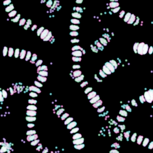
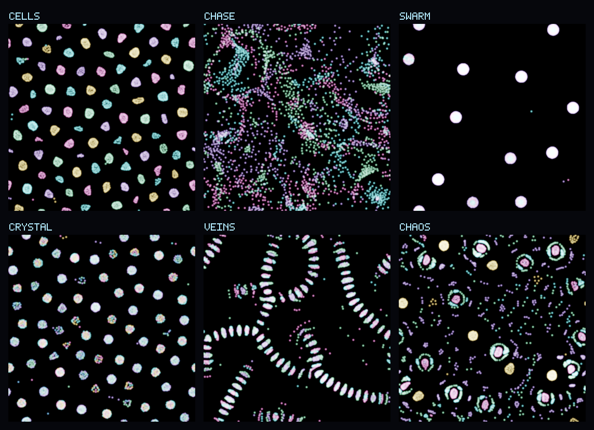
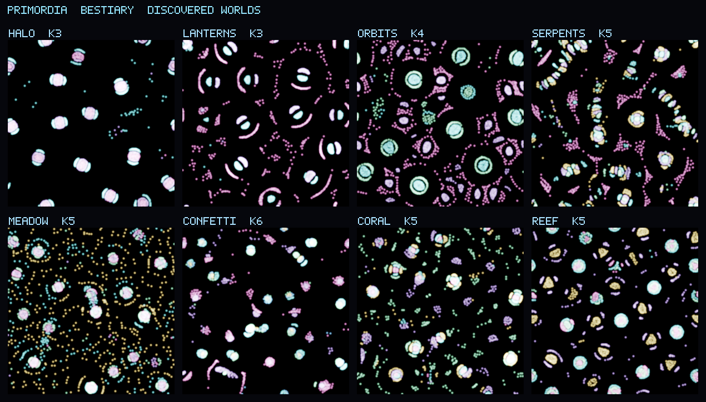

<div align="center">

# PRIMORDIA

### a universe in a single HTML file

Thousands of glowing particles. A handful of rules. **Nothing is scripted** —
the life self-organizes. GPU-accelerated artificial life in pure WebGL2, with
zero dependencies, zero build step, and zero network calls.



*The "Veins" world, actually running. Segmented worms grow, wander, and feed —
all from one signed attraction matrix. (Animated PNG; if your viewer shows a
still, it's one frame of a continuous loop.)*



*Six worlds, one engine. Each grown from the same one-line force law — only the
species-attraction matrix differs.*

</div>

---

## Run it

```
open index.html        # macOS
xdg-open index.html    # Linux
start index.html       # Windows
```

That's it. One file. No `npm install`, no server, no toolchain. Double-click works
(everything is inlined; no ES modules, no `fetch`). A WebGL2 browser with float
render targets is the only requirement (any recent Chrome / Edge / Firefox / Safari).

## What you're looking at

Every particle has a **species** (a color). Between any two species there's a
signed **attraction**. That's the entire model:

```
force(a, b) = matrix[species_a][species_b] · falloff(distance)
```

Run that across thousands of particles on the GPU, every frame, and lifelike
behavior *emerges*: membranes, predator/prey chases, pulsing cells, crystalline
lattices, migrating flocks, segmented worms. None of it is programmed. It's all
the matrix.

## How it works

The whole simulation lives in floating-point **textures** and runs as a fragment
shader, ping-ponging between two framebuffers each frame. That moves the O(N²)
particle interaction onto the GPU's thousands of cores in parallel, so it holds
**4k–16k particles at 60fps** with a real bloom pass on top.

| stage | what happens |
|-------|--------------|
| **sim** | fragment shader: for each particle, sum the species-matrix force from every other particle; integrate velocity + position; wrap toroidally |
| **draw** | one point per particle; vertex shader reads its texel, colors by species; additive blending → glow |
| **bloom** | bright-pass → separable Gaussian blur → ACES composite, for the luminous look |
| **god mode** | the mouse becomes a gravity well fed into the sim as a uniform |

## Controls

- **drag** — attract particles · **shift + drag** — repel
- **space** pause · **R** reseed · **N** new rules · **M** mutate · **P** palette · **G** genesis · **H** hide UI · **F** fullscreen · **S** snapshot
- Tune the **attraction matrix** live by dragging its cells (cyan = attract, magenta = repel)
- Six hand-built presets — **Cells · Chase · Swarm · Crystal · Veins · Chaos** — plus six **Discovered** worlds the evolutionary search dug up
- **Genesis autopilot** lets the universe run itself: it watches the world's structure and motion, gently mutates a living world, and triggers a *rebirth* when one goes static or blows apart. An endless self-curating screensaver.
- **Six palettes** (aurora, ember, ice, candy, toxic, mono)
- **Record** a `.webm` clip, grab a PNG **snapshot**, or **copy a share link** — the entire world (rules + physics) round-trips through the URL hash, so a link *is* the universe.

## Genesis & the Bestiary

The stable parameter space is mostly noise — most random rule-sets are boring. So
there's an **interestingness metric** (`evaluate` in the CPU core): it separates
real structure from gas/explosion using the *index of dispersion* of particle
density, and rewards *ongoing motion* (penalizing both frozen and chaotic worlds).
`tools/evolve.mjs` runs that metric across dozens of random universes in parallel
and renders a **hall of fame** of the winners — whose DNA is curated into the app's
Discovered worlds, and whose metric powers the live Genesis autopilot.



*The eight Discovered worlds that ship in the app — none designed, each one found by
scoring random rule-sets for "alive and structured," then named. This image is
rendered straight from the DNA in `index.html`, so it always matches what ships.*

## The CPU twin (`tools/`)

The trickiest part of particle life is that it's invisible until it runs — and the
stable parameter regime is narrow (too hot a timestep and everything detonates
into noise). So before the GPU ever ran, the **exact same force law** was ported to
a dependency-free CPU simulator that renders real PNGs. It caught an exploding-`dt`
bug, then minted the proven-good defaults the GPU now ships with.

```
node tools/render.mjs          # one world: primordial soup → self-organized cells
node tools/preset.mjs Veins    # render a single preset to stills/
node tools/montage.mjs         # stitch the labeled preset gallery
node tools/evolve.mjs 64       # search 64 random worlds → stills/hall_of_fame.png
node tools/anim.mjs Veins      # render the looping APNG hero
node tools/bestiary.mjs        # re-render the curated showcase from index.html's DNA
node tools/test.mjs            # 20 invariant tests for the core + codecs
```

The CPU and GPU share one source of truth for the math, so the stills are an honest
preview of the live app — not a mockup.

---

<div align="center">
<sub>Built for the fun of it.</sub>
</div>
